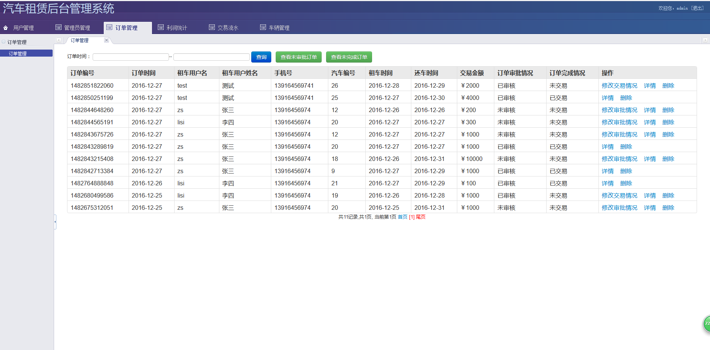
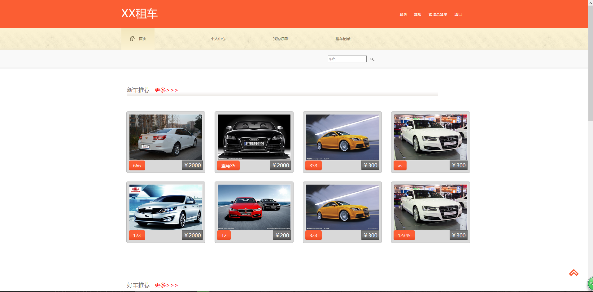
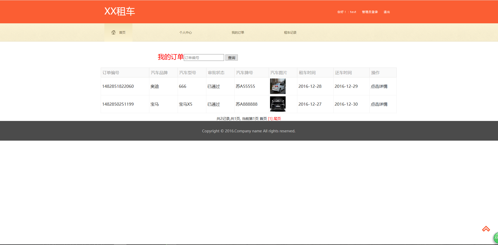
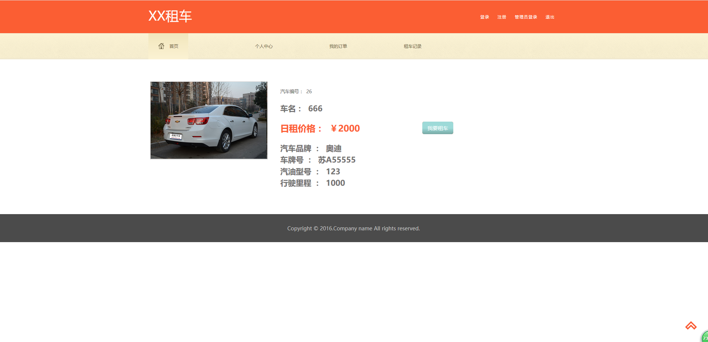
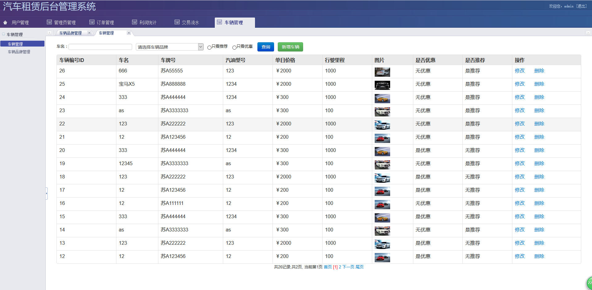
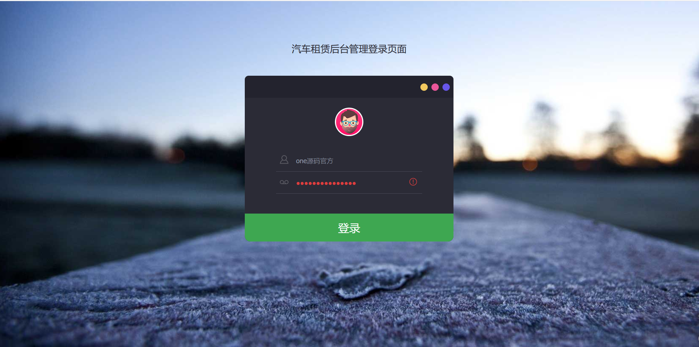

## 基于JSP+Servlet实现的汽车租赁管理系统

###  获取sql数据库文件: 从戎源码网 (https://armycodes.com/) QQ: 386869957 QQ群: 377586148
###  所有系统地址: (https://github.com/YuLin-Coder/AllProjectCatalog) 
###  所有项目以及源代码本人均调试运行无问题 可支持远程安装部署调试、定制修改、代码讲解

## 项目介绍
基于JSP+Servlet实现的汽车租赁管理系统，主要功能如下

【客户】功能：

注册和登录：客户可以通过注册账号并登录系统来使用租赁管理系统的功能。
汽车浏览和搜索：客户可以浏览可租赁的汽车列表，并根据需求进行搜索和筛选。
汽车租赁：客户可以选择汽车并提交租赁请求，包括选择租赁时间、取车和还车地点等。
订单管理：客户可以查看和管理自己的订单，包括查看订单详情、取消订单等操作。
个人信息管理：客户可以修改个人信息，包括联系方式、密码等。

【管理员】功能：

登录和权限管理：管理员可以通过登录系统获取管理员权限，以执行管理操作。

用户管理：管理员可以管理系统中的用户信息，包括查看用户列表、添加新用户、编辑用户信息、冻结或删除用户等操作。
管理员管理：管理员可以管理系统中的管理员账号，包括添加新管理员账号、编辑管理员账号信息、修改密码、删除管理员账号等操作。
订单管理：管理员可以查看和管理系统中的订单信息，包括查看订单列表、查看订单详情、处理订单请求、取消订单、修改订单状态等操作。
利润统计：管理员可以对系统进行利润统计，包括根据时间段、汽车类型等进行统计，并生成报表。
交易流水：管理员可以查看系统中的交易流水记录，包括租车交易、还车交易、支付记录等。
车辆管理：管理员可以管理系统中的车辆信息，包括添加新车辆、编辑车辆信息、删除车辆、修改车辆状态等操作。

## 项目技术
- 编程语言：Java
- 数据库：MySQL
- 前端技术：JSP、JavaScript、bootstrap、JQuery
- 后端技术：Servlet、JDBC

## 运行环境
- JDK版本：JDK1.8及以上
- 开发工具：IDEA、Ecplise、Myecplise都可以
- 数据库: MySQL5.7及以上

## 运行截图

